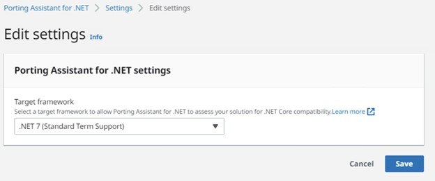
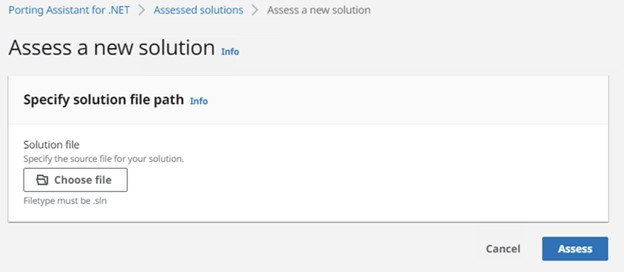
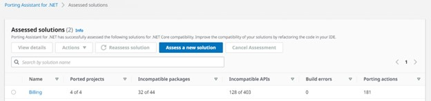
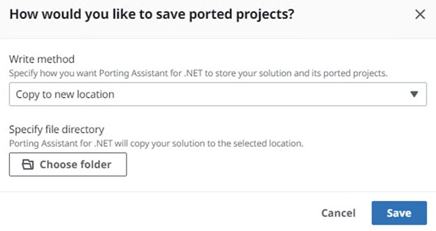
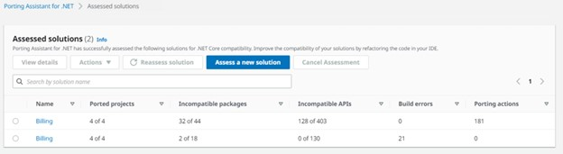

# AWSAppModernizationImmersionDayWorkshop

1. Visual Studio Installer Download Link: [https://visualstudio.microsoft.com/downloads/](https://visualstudio.microsoft.com/downloads/) 
    1. .Net Framework SDK: Please select .Net Framework SDK **version 4.6.1** in Visual Studio Installer. 
2. Porting Assistant for .NET Download Link: [https://aws.amazon.com/porting-assistant-dotnet/](https://aws.amazon.com/tr/porting-assistant-dotnet/)  

3. Please run the git command in the Windows terminal: 

    git clone [https://github.com/imcody/ASP.NET-MVC-Customer-Billing-Management.git](https://github.com/imcody/ASP.NET-MVC-Customer-Billing-Management.git) 

4. Please open the project with Visual Studio and build the solution
5. Please open the Porting Assistant for .NET

    a. Click on the Get Started button
   
   
   
    b. Set target framework version .NET 7 and save 

7. Please click on Assess New Solution button
   

7. Assessment Result
   
 
 
 
8. Port Solution
   
 
 
 

9. Ported Project Result
    
 
 

 
10. Please refactor and replace the codes that use incompatible Nuget packages or deprecated codes (attributes, methods, classes, interfaces, etc.)
    
 
 
 
